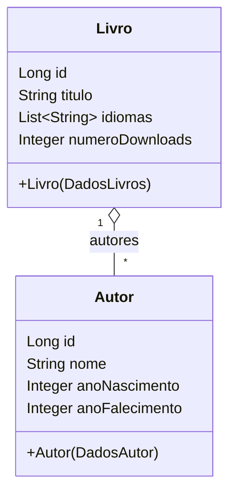

# pom.xml

O arquivo **pom.xml** define a configuração do projeto Maven, incluindo informações de metadata e dependências necessárias.

- **Model Version**: 4.0.0  
- **Parent**: Spring Boot Starter Parent (versão 4.0.2)  
- **Java**: Versão 17  

### Dependências principais

| Dependência                             | Propósito                                                          |
|-----------------------------------------|--------------------------------------------------------------------|
| Spring Boot Starter                     | Núcleo do Spring Boot                                              |
| Spring Boot Starter Web                 | Suporte a aplicações web e RestTemplate                            |
| Spring Boot Starter Data JPA            | Integração com Spring Data JPA                                     |
| PostgreSQL                              | Driver JDBC para PostgreSQL                                        |
| Jackson Databind                        | Serialização e desserialização de JSON                             |
| OpenAI GPT-3 Java Service               | Cliente para consumo do OpenAI GPT-3                               |
| Spring Boot DevTools (runtime, opcional)| Ferramentas de desenvolvimento com recarga automática              |

```xml
<properties>
  <java.version>17</java.version>
</properties>
<dependencies>
  <!-- Núcleo e Web -->
  <dependency>
    <groupId>org.springframework.boot</groupId>
    <artifactId>spring-boot-starter-web</artifactId>
  </dependency>
  <!-- JPA e Banco de Dados -->
  <dependency>
    <groupId>org.springframework.boot</groupId>
    <artifactId>spring-boot-starter-data-jpa</artifactId>
  </dependency>
  <dependency>
    <groupId>org.postgresql</groupId>
    <artifactId>postgresql</artifactId>
    <scope>runtime</scope>
  </dependency>
  <!-- JSON -->
  <dependency>
    <groupId>com.fasterxml.jackson.core</groupId>
    <artifactId>jackson-databind</artifactId>
    <version>2.15.2</version>
  </dependency>
  <!-- Outros -->
  <dependency>
    <groupId>com.theokanning.openai-gpt3-java</groupId>
    <artifactId>service</artifactId>
    <version>0.14.0</version>
  </dependency>
</dependencies>
```

---

# application.properties

Este arquivo configura as propriedades de conexão com o banco de dados e o comportamento do JPA.

- **spring.datasource.url**: URL de conexão PostgreSQL com variáveis de ambiente  
- **spring.datasource.username/password**: Credenciais do banco  
- **hibernate.dialect**: Dialeto HSQL (ajuste para PostgreSQL em produção)  
- **spring.jpa.hibernate.ddl-auto=update**: Atualiza esquema automaticamente  
- **spring.jpa.show-sql/format-sql**: Exibe e formata as consultas SQL  

```properties
spring.application.name=apiLivros
spring.datasource.url=jdbc:postgresql://${DB_HOST}/${DB_NAME}
spring.datasource.username=${DB_USER}
spring.datasource.password=${DB_PASSWORD}
spring.datasource.driver-class-name=org.postgresql.Driver
hibernate.dialect=org.hibernate.dialect.HSQLDialect
spring.jpa.hibernate.ddl-auto=update
spring.jpa.show-sql=true
spring.jpa.format-sql=true
```

---

# ApiLivrosApplication.java

Classe principal do Spring Boot.  

- Marca a aplicação com `@SpringBootApplication`.  
- Implementa `CommandLineRunner` para executar lógica na inicialização.  
- Injeta `LivroRepository` e `AutorRepository`.  
- Instancia `Principal` e chama `exibeMenu()` no método `run`.

```java
@SpringBootApplication
public class ApiLivrosApplication implements CommandLineRunner {
    @Autowired
    private LivroRepository livroRepository;
    @Autowired
    private AutorRepository autorRepository;

    public static void main(String[] args) {
        SpringApplication.run(ApiLivrosApplication.class, args);
    }

    @Override
    public void run(String... args) throws Exception {
        Principal principal = new Principal(livroRepository, autorRepository);
        principal.exibeMenu();
    }
}
```

---

# Principal.java 🚀

Controla o fluxo do **menu CLI** e interage com os serviços, modelos e repositórios.

- Usa `Scanner` para leitura de console.  
- Constrói URL de busca na API externa Gutendex.  
- Métodos principais:
  - `exibeMenu()`: loop de opções (buscar, listar, filtrar).  
  - `buscarLivro()`: chama API externa, converte dados e persiste novo livro.  
  - `listarTodosLivros()`, `listarTodosAutores()`: exibem registros ordenados.  
  - `listarAutoresVivosNesteAno()`, `listarLivrosNoIdiomaDesejado()`: filtros customizados.  

```java
public class Principal {
    private final String ENDERECO = "https://gutendex.com/books?search=";
    private Scanner leitura = new Scanner(System.in);
    private ConsumoApi consumo = new ConsumoApi();
    private ConverteDados conversor = new ConverteDados();
    private LivroRepository livroRepository;
    private AutorRepository autorRepository;

    public Principal(LivroRepository livroRepository, AutorRepository autorRepository) {
        this.livroRepository = livroRepository;
        this.autorRepository = autorRepository;
    }

    public void exibeMenu() {
        int opcao = -1;
        while (opcao != 0) {
            System.out.println("""
                ### MENU LIVROS ###
                1 - Buscar Livros
                2 - Listar Livros
                3 - Listar Autores
                4 - Autores Vivos em Ano
                5 - Livros por Idioma
                0 - Sair
                """);
            opcao = leitura.nextInt(); leitura.nextLine();
            switch (opcao) {
                case 1 -> buscarLivro();
                case 2 -> listarTodosLivros();
                case 3 -> listarTodosAutores();
                case 4 -> listarAutoresVivosNesteAno();
                case 5 -> listarLivrosNoIdiomaDesejado();
                case 0 -> { System.out.println("Saindo."); System.exit(0); }
                default -> System.out.println("Opção inválida");
            }
        }
    }
    // ... outros métodos
}
```

---

# Service

## ConsumoApi.java

Componente Spring que efetua requisição HTTP GET usando `RestTemplate`.

```java
@Component
public class ConsumoApi {
    public String obterDados(String endereco) {
        RestTemplate restTemplate = new RestTemplate();
        return restTemplate.getForObject(endereco, String.class);
    }
}
```

## IConverteDados.java

Interface genérica para conversão de JSON em objetos Java.

```java
public interface IConverteDados {
    <T> T obterDados(String json, Class<T> classe);
}
```

## ConverteDados.java

Implementação de `IConverteDados` que usa Jackson `ObjectMapper` para desserializar JSON.

```java
public class ConverteDados implements IConverteDados {
    private ObjectMapper mapper = new ObjectMapper();

    @Override
    public <T> T obterDados(String json, Class<T> classe) {
        try {
            return mapper.readValue(json, classe);
        } catch (JsonProcessingException e) {
            throw new RuntimeException(e);
        }
    }
}
```

---

# Model (Entidades) 🗂️

Este pacote contém tanto os **mapeamentos JPA** quanto os **records** para desserialização da API externa.

## Livro.java

- Entidade JPA mapeada em `livros`.  
- Campos: `id`, `titulo` (único), `idiomas`, `numeroDownloads`.  
- Relação **OneToMany** com `Autor` (cascade ALL, fetch EAGER).  
- Construtor que recebe `DadosLivros` e popula lista de `Autor`.

```java
@Entity
@Table(name = "livros")
public class Livro {
    @Id @GeneratedValue(strategy = GenerationType.IDENTITY)
    private Long id;
    @Column(unique = true)
    private String titulo;
    @ElementCollection(fetch = FetchType.EAGER)
    private List<String> idiomas;
    private Integer numeroDownloads;
    @OneToMany(mappedBy = "livro",
               cascade = CascadeType.ALL,
               fetch = FetchType.EAGER)
    private List<Autor> autores;

    public Livro(DadosLivros dadosLivro) {
        this.titulo = dadosLivro.titulo();
        this.idiomas = dadosLivro.idiomas();
        this.numeroDownloads = dadosLivro.numeroDownloads();
        this.autores = dadosLivro.autores().stream()
            .map(d -> {
                Autor autor = new Autor(d);
                autor.setLivro(this);
                return autor;
            })
            .collect(Collectors.toList());
    }
    // getters, setters, toString()
}
```

## Autor.java

- Entidade JPA em `autores`.  
- Campos: `id`, `nome`, `anoNascimento`, `anoFalecimento`.  
- Relação **ManyToOne** com `Livro`.

```java
@Entity
@Table(name = "autores")
public class Autor {
    @Id @GeneratedValue(strategy = GenerationType.IDENTITY)
    private Long id;
    private String nome;
    private Integer anoNascimento;
    private Integer anoFalecimento;
    @JoinColumn(name = "livro_id")
    private Livro livro;

    public Autor(DadosAutor dadosAutor) {
        this.nome = dadosAutor.nome();
        this.anoNascimento = dadosAutor.anoNascimento();
        this.anoFalecimento = dadosAutor.anoFalecimento();
    }
    // getters, setters, toString()
}
```

## Record para API externa

```java
@JsonIgnoreProperties(ignoreUnknown = true)
public record DadosAutor(
    @JsonAlias("name") String nome,
    @JsonAlias("birth_year") Integer anoNascimento,
    @JsonAlias("death_year") Integer anoFalecimento
) {}

@JsonIgnoreProperties(ignoreUnknown = true)
public record DadosLivros(
    @JsonAlias("title") String titulo,
    @JsonAlias("authors") List<DadosAutor> autores,
    @JsonAlias("languages") List<String> idiomas,
    @JsonAlias("download_count") Integer numeroDownloads
) {}

@JsonIgnoreProperties(ignoreUnknown = true)
public record RespostaApi(
    @JsonAlias("results") List<DadosLivros> livros
) {}
```

### Diagrama de Classes das Entidades



---

# Repository

## LivroRepository.java

Interface Spring Data JPA para `Livro`.  

- `findByTituloIgnoreCase(String titulo)`: busca exata sem considerar maiúsculas.  
- `findByIdiomasContaining(String idioma)`: lista livros que contêm determinada sigla de idioma.

```java
public interface LivroRepository extends JpaRepository<Livro, Long> {
    Optional<Livro> findByTituloIgnoreCase(String titulo);
    List<Livro> findByIdiomasContaining(String idioma);
}
```

## AutorRepository.java

Interface Spring Data JPA para `Autor`.  

- `findAllByOrderByNomeAsc()`: lista todos os autores ordenados por nome.  
- `buscarAutoresVivosEmAno(int ano)`: consulta customizada para autores vivos em dado ano.

```java
public interface AutorRepository extends JpaRepository<Autor, Long> {
    List<Autor> findAllByOrderByNomeAsc();

    @Query("""
        SELECT a FROM Autor a
         WHERE a.anoNascimento <= :ano
           AND (a.anoFalecimento IS NULL OR a.anoFalecimento >= :ano)
    """)
    List<Autor> buscarAutoresVivosEmAno(int ano);
}
```

---

# ApiLivrosApplicationTests.java

Classe de testes que verifica o carregamento do contexto Spring Boot.

```java
@SpringBootTest
class ApiLivrosApplicationTests {
    @Test
    void contextLoads() {}
}
```

---

Este conjunto de arquivos forma uma aplicação de console baseada em Spring Boot que consome dados da API externa Gutendex, converte-os em objetos Java, persiste em um banco PostgreSQL e oferece diversas opções de consulta via menu interativo.